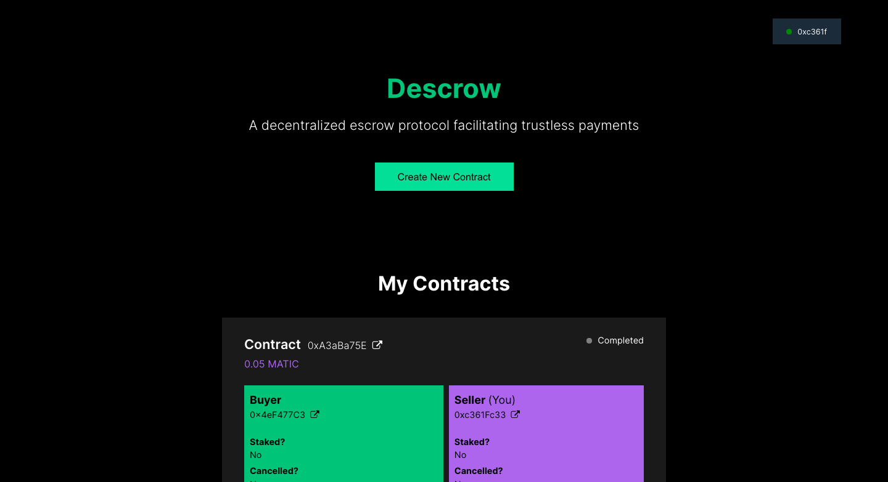

# Descrow

Descrow is a decentralized escrow protocol that facilitates secure payments between trustless parties. Using the descrow protocol, you can transfer goods, services, and money with another party (that you do not trust) without having to worry about fraud or commission fees.

## How it works

Descrow uses staking to ensure that both parties are forced to comply and reach a consensus on their agreement. Failure to reach consensus would result in loss of stake for both parties. 

These are the steps followed while using the descrow protocol.

1. Two parties, buyer and seller, enter an agreement. Buyer agrees to buy a good/service from seller for a pre-determined amount X. 
2. Buyer commits to keeping their side of the bargain by staking an amount equivalent to 2X into the contract.
3. Seller commits to keeping their side of the bargain by staking an amount equivalent to X into the contract.
4. Once both parties have staked, the contract is locked and active. 
5. Once the buyer is satisfied with the transaction, they can confirm the end of the agreement. Upon confirmation, the contract will send 2X to the seller and refund X to the buyer.
6. If the buyer and seller mutually agree to cancel the agreement, the contract refunds the buyer 2X and the seller X.
7. If buyer and seller cannot reach consensus, the amount remains locked in the contract.

## Use Cases

We foresee the following use cases for the Descrow protocol.

1. Powering payments of P2P marketplaces like eBay and Binance.
2. Enabling creators, freelancers, and other self-employed people to enter into agreements over small sums and with larger parties.
3. Enabling the trade of goods and services without having to deal with the issues of centralized escrow systems like commission and power imbalance.

## Future Improvements

The Descrow team is currently considering the following improvements to the protocol.

### Incorporating commissions

Currently, the protocol works on a completely decentralized, zero-commission model. We are considering giving the option to enitites employing the protocol to add a commission fee for providing services such as the frontend.

### Staking amounts

We are currently debating changing the stake amounts from 2:1 to 2:2 where both buyer and seller stake twice the contract's value. For the time being, we have kept it at 2:1 to be a little more seller-friendly and make it more lucrative for use case (2).

### Enabling automation

The current protocol requires both parties participating to proactively stake, cancel, and/or confirm. In the future, we will be adding functionality to allow parties to delegate this responsibility as well as trigger actions automatically upon the occurence of certain events (both on-chain and off-chain).

## App

A demo app running on the Polygon MATIC Mumbai testnet can be accessed [here](https://descrow-eight.vercel.app).